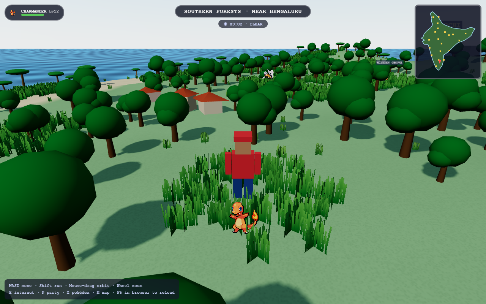
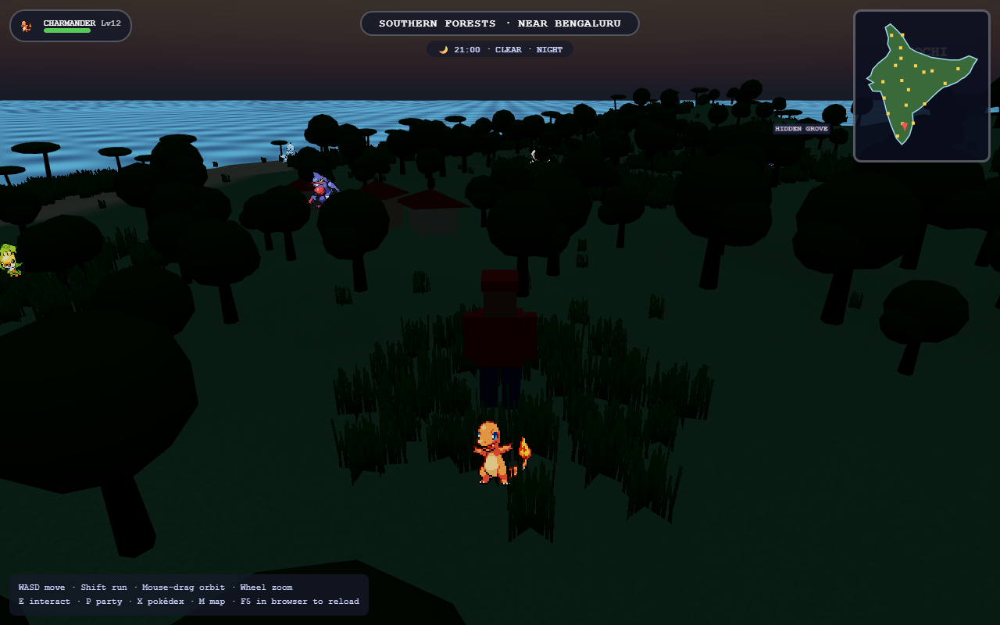
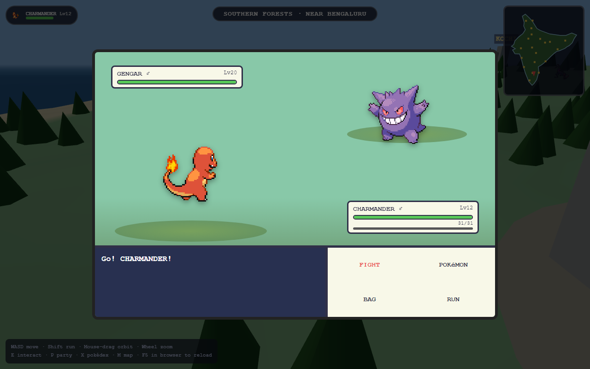

# POKeMON INDIA — Claude Edition

An open-world 3D Pokémon game in the browser. The map is a stylized 3D India —
the Himalaya in the north, the Thar desert in the west, the Western Ghats,
southern forests, eastern jungles and 7,000 km of coastline — with **all 898
Pokémon of Generations 1–8** living in biome-appropriate regions.





## Play

```
python -m http.server 8000        # any static server works
# then open http://localhost:8000
```

(It must be served over HTTP — ES modules don't run from `file://`.)

## What's in the game

- **Open world**: walk/run across India in third person. 20 real cities
  (Bengaluru is home) with houses, street lamps and Pokécenters, connected by
  a road network with villages along the way. Physical sky with a full
  **day/night cycle** (1 game hour = 1 real minute), sun shadows, animated
  water, and biome vegetation — palms on the coast, pines in the hills,
  snow pines and rocks in the Himalaya, cacti in the Thar. Minimap + full
  region map (M). Add `?low` to the URL on weak GPUs.
- **Tall grass**: patches everywhere — wild Pokémon cluster in them, and
  walking through tall grass triggers surprise encounters.
- **Weather**: per-biome rain, snow, sandstorms, fog and harsh sun with
  particle effects. Weather and time change what spawns (ghost/dark at
  night, water types in rain…) and modify battle damage (rain boosts water
  moves 1.5x and halves fire, sun the reverse).
- **Friendship & follower**: your lead Pokémon walks behind you and emotes
  by mood, weather and friendship. Friendship grows by walking, battling
  and levelling — high friendship sharpens crits and can let a Pokémon
  endure a lethal hit at 1 HP.
- **Wild temperament**: hard-hitting species chase you, fast frail ones
  flee, and some sleep at night (sleeping wilds are twice as easy to catch).
- **All 898 Pokémon, real data**: base stats, types, catch rates, gender
  ratios, level-up learnsets, evolution levels and dex entries baked from
  [PokéAPI](https://pokeapi.co) (the same game data Bulbapedia documents).
  Official sprites: pixel sprites as overworld billboards and battle
  front/back sprites, official artwork in the dex.
- **Biome spawning**: water types on the coasts, ice/dragon/rock in the
  Himalaya, ground/fire in the Thar, bug/poison/grass in the forests,
  ghost/dark in the eastern jungle, electric/psychic/steel in cities. Rarity
  is weighted by base-stat total; levels scale with distance from Bengaluru.
- **22 legendary landmarks**: fixed shrines (Sky Pillar Peak in the high
  Himalaya, the Sacred Ghat at Varanasi, the White Rann Crater…) each holding
  one legendary — one chance each.
- **Battles**: full 18-type chart, physical/special split, STAB, crits,
  accuracy, priority, speed order, PP, switching. The trainer AI estimates
  real damage, takes guaranteed KOs and switches out of bad matchups.
- **Catching**: the Gen-3 capture formula with Poké/Great/Ultra balls,
  shake checks and HP-based odds.
- **Progression**: EXP, level-ups, move learning (with replace prompts),
  level-based evolution, IVs (0–31), all 25 natures, genders, 1/512 shinies.
- **Pokédex**: seen/caught counts and percentages over 898, silhouettes for
  unseen species, full data + flavor text once caught.
- **Trainer CLAUDE** waits in Delhi with his classic six (Gengar, Dragonite,
  Blastoise, Arcanine, Alakazam, Snorlax) — he scales to your level and gets
  +3 levels every time you beat him.
- **Saving**: automatic (localStorage), with PC box storage.

### Controls

| Key | Action |
|---|---|
| WASD / Shift | Move / run |
| Mouse drag / wheel | Orbit / zoom camera |
| E | Battle wild Pokémon · Pokécenter · Trainer CLAUDE |
| P / X / M | Party & box / Pokédex / Region map |

## Project layout

```
index.html        game shell + UI markup/CSS
src/data.js       dex loading, type chart, stat/damage/catch math (pure — server-reusable)
src/world.js      India terrain, biomes, cities, landmarks, maps
src/player.js     character + camera
src/spawns.js     wild spawn pools + billboards
src/battle.js     battle engine + GBA-style overlay
src/ui.js         pokédex / party / summary / box
src/save.js       localStorage persistence
src/net.js        multiplayer interface stub (see roadmap)
data/             baked pokedex.json + moves.json (regenerate: npm run bake)
tools/            PokéAPI baker + puppeteer e2e smoke tests
pokemon.html      the original 2D 6v6 battle game (classic mode)
```

## Multiplayer roadmap

The code is structured so going online is additive, not a rewrite:

1. **Server**: Node.js + WebSocket, authoritative. Rooms sharded by map
   region. Clients stream position/heading at ~10 Hz; the server broadcasts
   nearby players, rendered as other trainers in-world.
2. **PvP battles**: walk up to another player, challenge them (the
   `net.js` hook already exists). Both clients submit actions; the server
   runs the same pure battle math exported by `src/data.js`, so results are
   authoritative and cheat-proof — you fight their *actual* caught team.
3. **Accounts**: the save JSON (`src/save.js`) moves server-side as-is.
4. **Trading** and co-op legendary raids after that.

## Dev verification

- `node tools/e2e_test.mjs` — boots the game headless, runs a wild battle
  turn, checks narration and screenshots.
- `node tools/e2e_ui_test.mjs` — dex grid (898 cells), detail entries,
  party/IV summary.
- Type-chart spot checks: Dark vs Ghost/Poison = 2× (Crunch crushes Gengar
  now), Electric vs Ground = 0×, Ice vs Dragon/Flying = 4×.

Fan project for personal use. Pokémon and all related assets belong to
Nintendo / Creatures / GAME FREAK. Sprite/data sources: PokéAPI.
