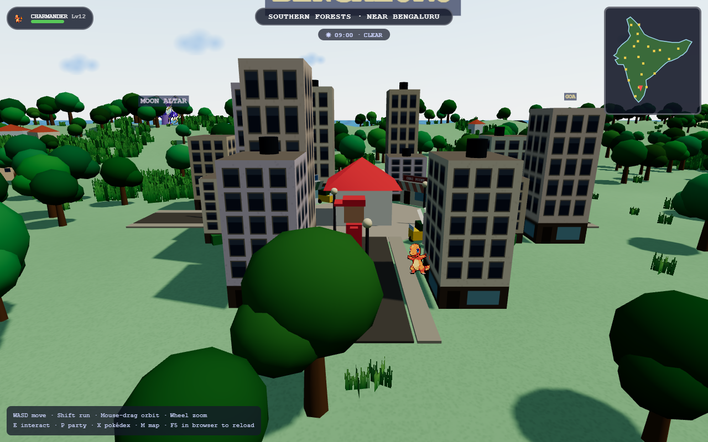
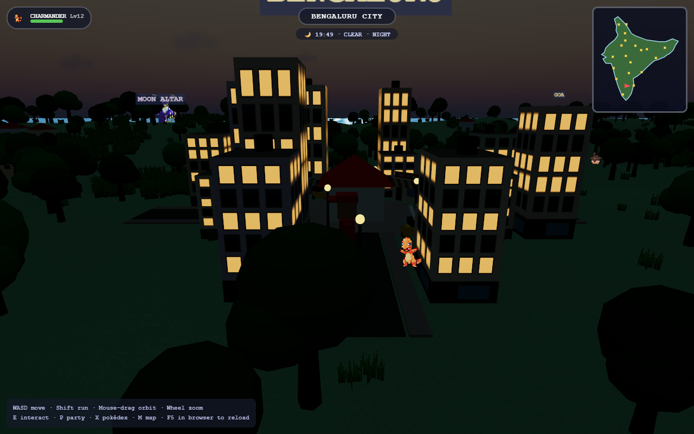
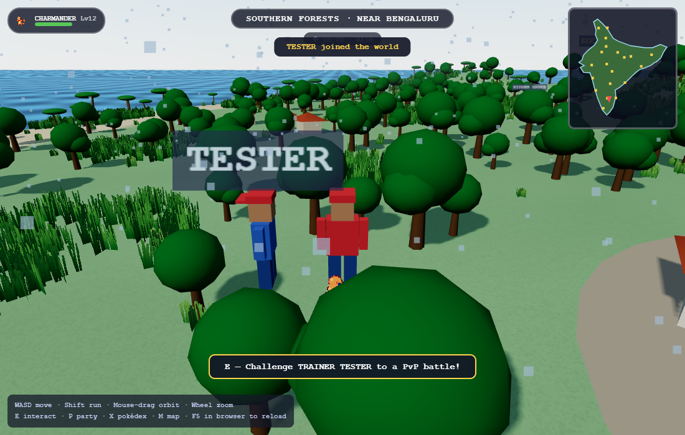
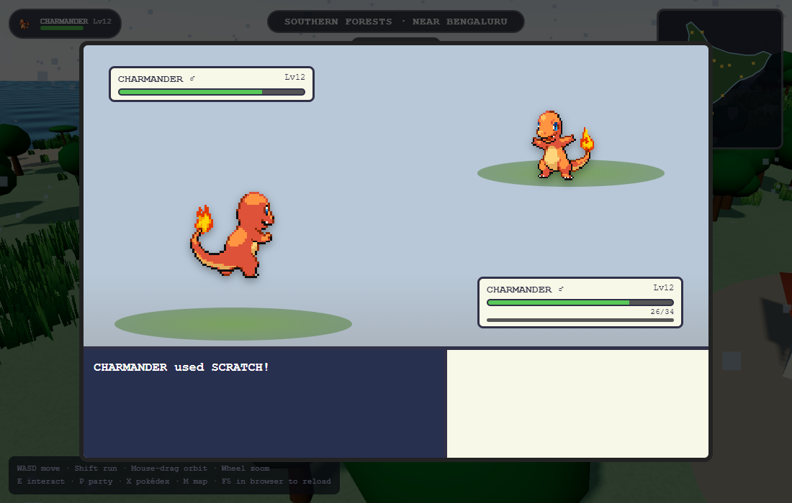

# POKeMON INDIA — Claude Edition

> 📖 **[DOCUMENTATION.md](DOCUMENTATION.md)** — the master manual: how to
> play, how it's made, running, testing, deployment, troubleshooting.
> 🧠 **[CONTEXT.md](CONTEXT.md)** — full development context for contributors.
> 🎮 **Play now (single-player):** https://sv-1411.github.io/pokemon/

An open-world 3D Pokémon game in the browser. The map is a stylized 3D India —
the Himalaya in the north, the Thar desert in the west, the Western Ghats,
southern forests, eastern jungles and 7,000 km of coastline — with **all 898
Pokémon of Generations 1–8** living in biome-appropriate regions.








## Play

**Multiplayer (recommended):**
```
cd server && npm install && node index.mjs
# → open http://localhost:8128  (share http://<your-ip>:8128 on your LAN)
```
Everyone who opens that URL walks the same India. You'll see other trainers
in-world with name tags — walk up to one and press **E** to challenge them to
a PvP battle with your real caught teams (they press **Y** to accept).

**Solo:** any static server works (`python -m http.server 8000`) — the game
detects there's no server and runs offline.

## What's in the game

- **Open world**: walk/run across India in third person. 20 real cities
  (Bengaluru is home) built as proper towns — a central plaza and radiating
  streets with sidewalks, multi-storey buildings with procedurally textured
  facades whose **windows light up at night**, shops with striped awnings and
  signboards (Poké Mart, Chai Point, Dosa Corner…), parked auto-rickshaws,
  rooftop water tanks, hedges and street lamps — all connected by a road
  network with villages along the way. Physical sky with a full **day/night
  cycle** (1 game hour = 1 real minute), drifting clouds, bloom
  post-processing, sun shadows, animated water, and biome vegetation with
  per-tree colour variation — palms on the coast, pines in the hills, snow
  pines and rocks in the Himalaya, cacti in the Thar. Minimap + full region
  map (M). Add `?low` to the URL on weak GPUs (`?nobloom` to skip only bloom).
- **Tall grass**: patches everywhere — wild Pokémon cluster in them, and
  walking through tall grass triggers surprise encounters.
- **Weather**: per-biome rain, snow, sandstorms, fog and harsh sun with
  particle effects. Weather and time change what spawns (ghost/dark at
  night, water types in rain…) and modify battle damage (rain boosts water
  moves 1.5x and halves fire, sun the reverse).
- **Friendship & follower**: your lead Pokémon walks behind you and emotes
  by mood, weather and friendship. Friendship grows by walking, battling
  and levelling — high friendship sharpens crits and can let a Pokémon
  endure a lethal hit at 1 HP.
- **Wild temperament**: hard-hitting species chase you, fast frail ones
  flee, and some sleep at night (sleeping wilds are twice as easy to catch).
- **All 898 Pokémon, real data**: base stats, types, catch rates, gender
  ratios, level-up learnsets, evolution levels and dex entries baked from
  [PokéAPI](https://pokeapi.co) (the same game data Bulbapedia documents).
- **Fully animated Pokémon**: the official animated battle sprites
  (Showdown set) play everywhere — overworld creatures breathe, bounce and
  flap (decoded to 3D textures via WebCodecs), battles use animated
  front/back sprites, and the dex shows the animated form. Wild Pokémon
  hop while walking, lean into a sprint, startle-jump when they notice
  you, and doze at night.
- **Sound**: every species' **official cry** plays on battle entry and in
  the Pokédex (PokéAPI cries archive), plus a full synthesized SFX kit
  (hits, super-effective slams, faints, ball throws/shakes/catch clicks,
  level-up and heal jingles) and generated chiptune background music with
  separate overworld and battle themes. Toggle with **N**.
- **Anime-style world**: the trainer is a proportioned anime protagonist —
  round head with real eyes and cheek marks, spiky black hair under the
  red/white cap, jacket, gloves, backpack — who breathes when idle, swings
  his arms as he walks and leans into a sprint. Villagers come in four
  archetypes (men in kurtas, women in kurtis with dupattas, kids, elders
  with walking sticks). Houses are anime cottages: pastel walls, overhanging
  gabled roofs, chimneys, framed windows with flower boxes, door steps and
  picket fences. Cities have the dome-roofed red **Pokécenter** from the
  show and a blue-roofed **Poké Mart**. Battles pop with type-colored
  impact bursts and floating damage numbers.
- **Biome spawning**: water types on the coasts, ice/dragon/rock in the
  Himalaya, ground/fire in the Thar, bug/poison/grass in the forests,
  ghost/dark in the eastern jungle, electric/psychic/steel in cities. Rarity
  is weighted by base-stat total; levels scale with distance from Bengaluru.
- **22 legendary landmarks**: fixed shrines (Sky Pillar Peak in the high
  Himalaya, the Sacred Ghat at Varanasi, the White Rann Crater…) each holding
  one legendary — one chance each.
- **Battles**: full 18-type chart, physical/special split, STAB, crits,
  accuracy, priority, speed order, PP, switching. The trainer AI estimates
  real damage, takes guaranteed KOs and switches out of bad matchups.
- **Catching**: the Gen-3 capture formula with Poké/Great/Ultra balls,
  shake checks and HP-based odds.
- **Progression**: EXP, level-ups, move learning (with replace prompts),
  level-based evolution, IVs (0–31), all 25 natures, genders, 1/512 shinies.
- **Pokédex**: seen/caught counts and percentages over 898, silhouettes for
  unseen species, full data + flavor text once caught.
- **Walkable interiors**: step inside the Pokécenter (Nurse Joyti heals your
  party, the PC terminal opens your Box) and the Poké Mart, where you spend
  **₹ rupees** on balls and potions. Potions are usable mid-battle.
- **City NPCs**: pedestrians wander every plaza with local tips, and youth
  trainers challenge you to battles for prize money.
- **The India League — 8 gyms**: Electric (Bengaluru), Water (Mumbai), Rock
  (Jaipur), Grass (Kochi), Ghost (Kolkata), Bug (Guwahati), Ice (Shimla) and
  Dragon (Delhi). Each gym is a walkable arena with two trainees and a
  leader whose themed team scales with your badge count. Win all 8 to become
  **Champion of India**. Money comes from trainers, gyms and CLAUDE.
- **Trainer CLAUDE** waits in Delhi with his classic six (Gengar, Dragonite,
  Blastoise, Arcanine, Alakazam, Snorlax) — he scales to your level and gets
  +3 levels every time you beat him.
- **Saving**: automatic (localStorage), with PC box storage.

### Controls

| Key | Action |
|---|---|
| WASD / Shift | Move / run |
| Mouse drag / wheel | Orbit / zoom camera |
| E | Battle wild Pokémon · Pokécenter · Trainer CLAUDE |
| P / X / M | Party & box / Pokédex / Region map |

## Project layout

```
index.html        game shell + UI markup/CSS
src/data.js       dex loading, type chart, stat/damage/catch math (pure — server-reusable)
src/world.js      India terrain, biomes, cities, landmarks, maps
src/player.js     character + camera
src/spawns.js     wild spawn pools + billboards
src/battle.js     battle engine + GBA-style overlay
src/ui.js         pokédex / party / summary / box
src/save.js       localStorage persistence
src/net.js        multiplayer interface stub (see roadmap)
data/             baked pokedex.json + moves.json (regenerate: npm run bake)
tools/            PokéAPI baker + puppeteer e2e smoke tests
pokemon.html      the original 2D 6v6 battle game (classic mode)
```

## Multiplayer — how it works

`server/index.mjs` is an authoritative Node.js + WebSocket server that also
serves the game itself:

- **Presence**: clients stream position/heading at 10 Hz; everyone nearby is
  rendered in-world as a blue-shirted trainer with a name tag.
- **PvP battles are server-resolved and cheat-proof**: when a challenge is
  accepted, both sides submit only `(species, level, IVs, nature, moves)` —
  the server *recomputes all stats* from the dex data (`server/battlecore.mjs`,
  same formulas as the client), rejects illegal moves the species can't learn
  at that level, resolves every turn (priority, speed, full type chart, STAB,
  crits, PP), and streams an event list that both clients merely render
  (`src/pvp.js`). A client that lies about its Attack stat simply gets
  corrected; one that disconnects forfeits.
- PvP is an exhibition format: teams enter at full HP and your real party is
  untouched afterwards.

Verified by `node tools/e2e_mp_test.mjs`: boots two headless browsers against
one server, asserts they see each other, runs the challenge/accept flow, plays
a full battle to the end on both screens, and kills one mid-battle to check
the disconnect-forfeit path.

### Still on the roadmap
1. **Accounts**: move the save JSON (`src/save.js`) server-side, login by name+key.
2. **Region rooms**: shard presence by map region once player counts grow.
3. **Trading** and co-op legendary raids.
4. Public hosting (any Node host works — Railway/Fly/a VPS; it's one process).

## Dev verification

- `node tools/e2e_test.mjs` — boots the game headless, runs a wild battle
  turn, checks narration and screenshots.
- `node tools/e2e_ui_test.mjs` — dex grid (898 cells), detail entries,
  party/IV summary.
- Type-chart spot checks: Dark vs Ghost/Poison = 2× (Crunch crushes Gengar
  now), Electric vs Ground = 0×, Ice vs Dragon/Flying = 4×.

Fan project for personal use. Pokémon and all related assets belong to
Nintendo / Creatures / GAME FREAK. Sprite/data sources: PokéAPI.
